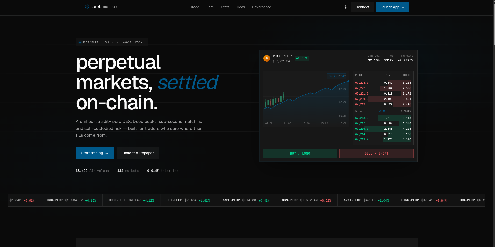
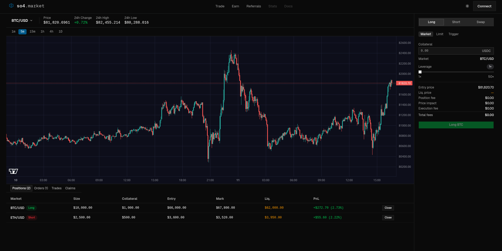
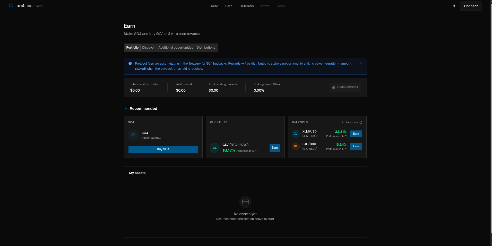

# SO4 Market

**On-chain perpetual markets, settled on Stellar.**

SO4 is a unified-liquidity perpetuals DEX built on Stellar/Soroban. Deep order books, sub-second matching, and self-custodied risk — built for traders who care where their fills come from.

---

## Screenshots

| Landing | Trade |
|---|---|
|  |  |

| Earn | Referrals |
|---|---|
|  |  |

---

## Table of Contents

- [Overview](#overview)
- [Screenshots](#screenshots)
- [Features](#features)
- [Tech Stack](#tech-stack)
- [Project Structure](#project-structure)
- [Getting Started](#getting-started)
- [Available Scripts](#available-scripts)
- [Architecture](#architecture)
- [Contributing](#contributing)
- [License](#license)

---

## Overview

SO4 Market is the front-end interface for the SO4 perpetuals protocol. It connects to Stellar Soroban smart contracts (ExchangeRouter, DataStore, SyntheticsReader, OrderVault) and streams live prices from Binance (primary) with GMX oracle as automatic fallback.

> **Status:** Active development. On-chain contract integration is in progress — the current build uses mock transactions with real UI and live price feeds.

---

## Features

| Area | Details |
|---|---|
| **Trade** | Long / Short / Swap with Market, Limit, and Trigger order types |
| **Chart** | Candlestick chart (lightweight-charts v5), live price updates, position entry & liquidation price lines, dark/light theme |
| **Positions** | Real-time positions, orders, trades, and claims tabs |
| **Earn** | Portfolio overview, pool discovery, additional opportunities, reward distributions |
| **Referrals** | Trader discount codes, affiliate tiers, commission distributions |
| **Landing** | Live market ticker, order book preview, protocol stats |
| **Theme** | Full dark / light mode with zero flash on load |

---

## Tech Stack

| Layer | Technology |
|---|---|
| Monorepo | [Turborepo](https://turbo.build) + [Bun](https://bun.sh) workspaces |
| Framework | [React 19](https://react.dev) + [Vite 7](https://vitejs.dev) |
| Routing | [TanStack Router v1](https://tanstack.com/router) |
| Server state | [TanStack Query v5](https://tanstack.com/query) |
| Styling | [Tailwind CSS v4](https://tailwindcss.com) |
| UI components | [shadcn/ui](https://ui.shadcn.com) (via `packages/ui` workspace) |
| Charts | [lightweight-charts v5](https://tradingview.github.io/lightweight-charts/) |
| Notifications | [Sonner](https://sonner.emilkowal.ski) |
| Blockchain | [Stellar](https://stellar.org) / [Soroban](https://soroban.stellar.org) |
| Oracle | Binance REST (primary) · GMX oracle (fallback) |
| Type safety | TypeScript 5.9 |

---

## Project Structure

```
so4-market/
├── apps/
│   └── web/                        # Main React/Vite application
│       ├── public/                 # Static assets (favicon, manifest, PWA icons)
│       ├── scripts/                # Build-time utilities
│       └── src/
│           ├── features/
│           │   ├── earn/           # Earn page — pools, portfolio, rewards
│           │   ├── referrals/      # Referrals — traders, affiliates, distributions
│           │   └── trade/          # Trade page — chart, order panel, positions
│           ├── routes/             # TanStack Router file-based routes
│           ├── styles/             # Global CSS (landing)
│           └── ui/                 # Shared UI — Navbar, ThemeProvider, landing sections
│
├── packages/
│   └── ui/                         # Shared component library (shadcn/ui)
│       └── src/
│           ├── components/         # Button, Input, Dialog, Tabs, Skeleton, …
│           ├── hooks/
│           ├── lib/
│           └── styles/
│               └── globals.css     # Tailwind base + CSS custom properties
│
├── turbo.json                      # Turborepo pipeline config
├── package.json                    # Root workspace manifest
├── tsconfig.json                   # Root TypeScript config
└── bun.lock
```

### Feature module layout

Each feature under `src/features/<name>/` follows the same convention:

```
<feature>/
├── components/     # React components (page + sub-components)
├── data/           # Static data / contract address constants
├── hooks/          # TanStack Query hooks (data fetching + mutations)
└── lib/            # Business logic, contract calls, type definitions
```

---

## Getting Started

### Prerequisites

| Tool | Version |
|---|---|
| [Bun](https://bun.sh) | ≥ 1.3 |
| [Node.js](https://nodejs.org) | ≥ 20 |

### Installation

```bash
# Clone the repository
git clone https://github.com/SO4-Markets/so4-monorepo.git
cd so4-monorepo

# Install all workspace dependencies
bun install
```

### Running the development server

```bash
# Start all apps in watch mode
bun dev

# Or start only the web app
cd apps/web && bun dev
```

The app will be available at [http://localhost:3000](http://localhost:3000).

### Building for production

```bash
bun build
```

Output is written to `apps/web/.output/`.

---

## Available Scripts

Run any of these from the **repository root**:

| Command | Description |
|---|---|
| `bun dev` | Start all packages in development mode |
| `bun build` | Build all packages for production |
| `bun lint` | Lint all packages with ESLint |
| `bun format` | Format all files with Prettier |
| `bun typecheck` | Run TypeScript type checks across all packages |

---

## Architecture

### Oracle / Price feeds

Live candle data and token prices are fetched from the Binance public REST API. If Binance is unavailable or rate-limited, the oracle module automatically retries against the GMX oracle endpoint. Both sources are normalised into a shared `OhlcBar` type (oldest-first, prices as numbers, time in Unix seconds).

### Contract integration

The `lib/stellar.ts`, `lib/earn.ts`, and `lib/referrals.ts` files define the full contract call surface. Each function is currently a **stub** that simulates latency and shows a toast — the real Stellar SDK + Soroban RPC calls are documented inline with `TODO` comments. Contracts to integrate:

- `ExchangeRouter` — `createOrder` (increase / decrease / swap)
- `DataStore` — on-chain key-value protocol config
- `SyntheticsReader` — `getMarketInfo`, `getPositionInfo`, `getOrderInfo` (batched)
- `OrderVault` — holds collateral between order creation and execution
- `StakingRouter` — `stakeSO4`, `unstakeSO4`
- `ReferralsRouter` — `setTraderReferralCodeByUser`, `registerCode`

### Theme system

The theme provider writes `dark` or `light` as a class on `<html>`. A blocking inline script in `<head>` reads `localStorage` before first paint to prevent flash of wrong theme. The chart component uses a `MutationObserver` on `document.documentElement` to re-apply color options instantly when the class changes.

---

## Contributing

Contributions are welcome. Please follow the steps below.

### 1. Fork and clone

```bash
git clone https://github.com/SO4-Markets/so4-monorepo.git
cd so4-monorepo
bun install
```

### 2. Create a branch

Use a short, descriptive name:

```bash
git checkout -b feat/order-book-component
git checkout -b fix/chart-theme-flash
git checkout -b chore/upgrade-tanstack-query
```

### 3. Make your changes

- Follow the existing feature-module structure (`components/`, `hooks/`, `lib/`, `data/`).
- Keep components focused — one responsibility per file.
- Use Tailwind utility classes; avoid inline styles.
- Run `bun format` before committing.

### 4. Commit style

We follow [Conventional Commits](https://www.conventionalcommits.org/):

```
feat: add limit order confirmation dialog
fix: resolve chart flicker on theme toggle
chore: upgrade lightweight-charts to 5.3
docs: document contract integration stubs
refactor: extract oracle normalisation into shared util
```

### 5. Open a pull request

Push your branch and open a PR against `main`. Include:

- **What** changed and **why**.
- Screenshots or recordings for UI changes.
- Notes on any contract-integration assumptions.

### Code style

| Rule | Detail |
|---|---|
| Formatter | Prettier (`bun format`) — config in `.prettierrc` |
| Linter | ESLint with `@tanstack/eslint-config` |
| Imports | Absolute workspace imports (`@workspace/ui/...`) preferred over deep relative paths |
| Comments | Only for non-obvious intent — avoid restating what the code already says |

### Reporting issues

Open an issue on GitHub with:

- A clear title and description.
- Steps to reproduce (for bugs).
- The expected vs actual behaviour.
- Browser / OS / Bun version if relevant.

---

## License

```
MIT License

Copyright (c) 2026 so4 labs

Permission is hereby granted, free of charge, to any person obtaining a copy
of this software and associated documentation files (the "Software"), to deal
in the Software without restriction, including without limitation the rights
to use, copy, modify, merge, publish, distribute, sublicense, and/or sell
copies of the Software, and to permit persons to whom the Software is
furnished to do so, subject to the following conditions:

The above copyright notice and this permission notice shall be included in all
copies or substantial portions of the Software.

THE SOFTWARE IS PROVIDED "AS IS", WITHOUT WARRANTY OF ANY KIND, EXPRESS OR
IMPLIED, INCLUDING BUT NOT LIMITED TO THE WARRANTIES OF MERCHANTABILITY,
FITNESS FOR A PARTICULAR PURPOSE AND NONINFRINGEMENT. IN NO EVENT SHALL THE
AUTHORS OR COPYRIGHT HOLDERS BE LIABLE FOR ANY CLAIM, DAMAGES OR OTHER
LIABILITY, WHETHER IN AN ACTION OF CONTRACT, TORT OR OTHERWISE, ARISING FROM,
OUT OF OR IN CONNECTION WITH THE SOFTWARE OR THE USE OR OTHER DEALINGS IN THE
SOFTWARE.
```

---

<p align="center">
  Built by <a href="https://so4.market">so4 labs</a> ·
  <a href="https://twitter.com/so4market">@so4market</a>
</p>


